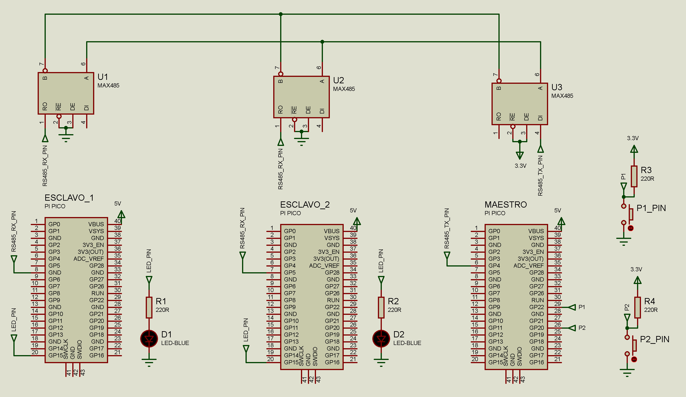

# ⚙️🦾 Resumen del proyecto 

Este programa corre en una Raspberry Pi Pico y es responsable de:

- Comunicar tres placas( 2 esclavos y 1 maestro) a travez de un protocolo RS-485
- Placa esclavo 1(led), placa esclavo2(led), placa maestro( P1 y P2 )
- Al presionar P1, no se mantiene retenido, los leds L1 y L2 cambiaran de estado
- Al presionar P2, no se mantiene retenido, el leds L2 comenzará a parpadear
- Si se vuelve a presionar P1, los leds se apagarán o mantendran el mismo estado

## 🔌 Periféricos utilizados

- UART (115200, 8N1)
- PULSADORES (pull_up)
- LED indicador (para subir/bajar)
- MODULOS MAX-485

## 📁 Archivos importantes

- `main.c` – Lógica principal del programa
- `funciones_lcd.c/.c` – Control del LCD
- `hardware.h` – Definiciones de pines y periféricos
- `systick.c/.h` – Temporización

## 📦 Dependencias

Este proyecto utiliza el **SDK oficial de Raspberry Pi Pico** y se construye con **CMake**.

